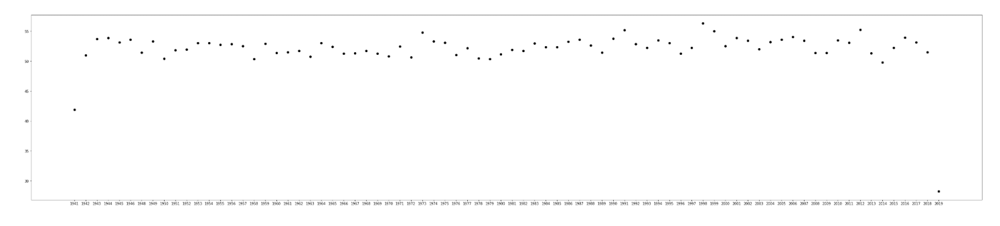

# report
## What is the first recorded observation in the data?

In station 725330, with wban id 14827 in 1941/11/01.   
The mean temperature was 49.1 Fahrenheit. 
The mean dew point was 43.90 Fahrenheit.
The mean visibility was 77.6 miles.
The mean wind speed was  27.5 knots.
The maximum sustained wind speed was 37.9 knots.
The maximum temperature was 63.3 Fahrenheit.
The minimum temperature was 42.4 Fahrenheit.
There were fog and rain / drizzle.
There were not snow / ice / pellets, hail, thunder or tornado / funnel cloud. 

## What is the highest recorded temperature, wind gust speed, and total precipitation in a single day?

The highest recorded temperature is 127.4 Fahrenheit.  

The highest recorded wind gust speed is 8 5.5 knots. 

The highest recorded total precipitation is 11.81 inches 

## Where and when did these extreme values occur (referring to the previous question) and to what degree were they anomolous?

The highest recorded temperature with station id 720266 in 2004/09/30 at warsaw municipal.

The highest recorded wind gust speed happened once in station 725337 in 2014/02/21 and another time in 2015/12/10 at same station at chicago airport. 

The highest recorded total precipitation happened in station id 725350 in 1973/05/10 at south bend regional airport. 

## 4 

